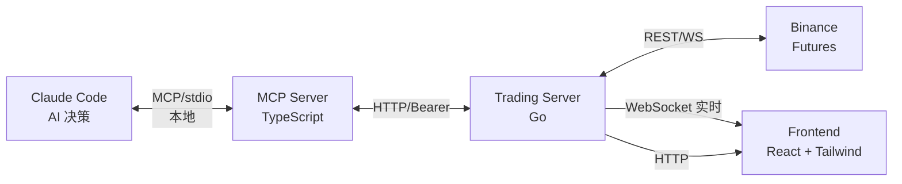

# MCP Trade

基于 Claude Code + MCP 协议的 **AI 主观交易系统**。让 AI 通过价格行为学（YTC / 裸 K 线）在 Binance 合约市场进行交易决策。

## 架构



### 数据流

```mermaid
sequenceDiagram
    participant AI as Claude Code
    participant MCP as MCP Server
    participant TS as Trading Server
    participant BN as Binance
    participant DB as DuckDB

    AI->>MCP: market.klines(BTCUSDT,1h)
    MCP->>TS: GET /api/v1/market/klines
    TS-->>MCP: 缓存命中 / WS 数据
    MCP-->>AI: Markdown 表格 + JSON

    AI->>MCP: order.place(preview)
    MCP->>TS: POST /api/v1/order/place
| POST | `/api/v1/order/modify_stop` | 修改止损 |

    TS->>TS: RiskManager 风控检查
    TS-->>MCP: plan_id + 风险预览
    MCP-->>AI: 预览确认

    AI->>MCP: order.place(confirm)
    MCP->>TS: POST confirm=true
    TS->>BN: 下单
    TS->>DB: 写入交易记录
    BN-->>TS: ORDER_TRADE_UPDATE (WS)
    TS->>DB: 更新 FILLED + pnl
    TS-->>MCP: 订单结果
    MCP-->>AI: 成交确认
```

## 快速开始

### 1. 部署 Trading Server（服务器）

```bash
# 环境要求: Go 1.25+, git
git clone https://github.com/Ye-Yu-Mo/mcp_trade.git
cd mcp_trade/trading-server

# 配置环境变量
cp .env.example .env
# 编辑 .env: 填入 BINANCE_API_KEY / BINANCE_API_SECRET / API_TOKEN

# 编译
go build -o bin/trade-server ./cmd/server/

# 安装 systemd 服务（开机自启 + 崩溃重启）
sudo cp mcp-trade.service /etc/systemd/system/
sudo systemctl daemon-reload
sudo systemctl enable --now mcp-trade
```

### 2. 配置 MCP Server（本地）

```bash
cd mcp_trade/mcp-server
npm install
npm run build
```

在 Claude Code 的 `.mcp.json` 中添加：

```json
{
  "mcpServers": {
    "mcp-trade": {
      "command": "node",
      "args": ["/path/to/mcp-server/dist/index.js"],
      "env": {
        "TRADING_SERVER_URL": "http://your-server:8877",
        "TRADING_API_TOKEN": "your-secret-token"
      }
    }
  }
}
```

### 3. 前端看板

浏览器打开 `http://your-server:8877/`，输入 API Token 即可查看实时持仓和行情。

## 环境变量

| 变量 | 必填 | 默认 | 说明 |
|------|------|------|------|
| `TRADE_ENV` | | testnet | testnet / mainnet |
| `BINANCE_API_KEY` | ✅ | | 币安 API Key |
| `BINANCE_API_SECRET` | ✅ | | 币安 API Secret |
| `API_TOKEN` | ✅ | | 前端和 MCP Server 鉴权 Token |
| `SERVER_PORT` | | 8877 | HTTP 服务端口 |
| `DB_PATH` | | data/trade.duckdb | DuckDB 数据库路径 |
| `MAX_POSITION_PERCENT` | | 0.1 | 单笔仓位上限（余额比例） |
| `MAX_STOP_LOSS_PERCENT` | | 0.02 | 单笔止损上限（余额比例） |
| `DAILY_LOSS_LIMIT` | | 100 | 每日最大亏损 (USDT) |

## MCP 工具列表（20 个）

### 行情 — market.*
| 工具 | 说明 |
|------|------|
| `market.klines` | K 线数据（价格行为交易核心） |
| `market.ticker` | 最新价格 |
| `market.price` | 纯价格（省 token） |
| `market.orderbook` | 订单簿深度 |
| `market.watch` | 一键获取全币种快照 |

### 账户 — account.*
| 工具 | 说明 |
|------|------|
| `account.balance` | 账户余额 |
| `account.positions` | 当前持仓 |

### 订单 — order.*
| 工具 | 说明 |
|------|------|
| `order.place` | 下单（Plan/Apply 闸门 + 风控检查） |
| `order.cancel` | 撤单 |
| `order.list` | 挂单列表 |
| `order.status` | 订单状态 |

### 交易日志 — trade.*
| 工具 | 说明 |
|------|------|
| `trade.history` | 历史交易 |
| `trade.journal` | 经验记录 |
| `trade.performance` | 绩效统计 |

## API 端点

| 方法 | 路径 | 说明 |
|------|------|------|
| GET | `/health` | 健康检查（公开） |
| GET | `/` | 交易看板（公开） |
| GET | `/api/v1/market/klines` | K 线 |
| GET | `/api/v1/market/ticker` | 价格 |
| GET | `/api/v1/market/orderbook` | 深度 |
| GET | `/api/v1/market/watch` | 全币种快照 |
| GET | `/api/v1/market/scanner` | 市场扫描 |
| GET | `/api/v1/market/funding` | 资金费率 |
| GET | `/api/v1/market/oi` | 未平仓合约 |
| GET | `/api/v1/market/calendar` | 经济日历 |
| POST | `/api/v1/market/alert` | 设价格提醒 |
| GET | `/api/v1/market/alerts` | 查提醒 |
| DELETE | `/api/v1/market/alert` | 删提醒 |

| GET | `/api/v1/account/balance` | 余额 |
| GET | `/api/v1/account/positions` | 持仓 |
| POST | `/api/v1/order/place` | 下单 |
| POST | `/api/v1/order/modify_stop` | 修改止损 |

| DELETE | `/api/v1/order/cancel` | 撤单 |
| GET | `/api/v1/order/list` | 挂单 |
| GET | `/api/v1/order/status` | 订单详情 |
| GET | `/api/v1/trade/history` | 交易历史 |
| POST | `/api/v1/trade/journal` | 写入日志 |
| GET | `/api/v1/trade/performance` | 绩效统计 |

所有 `/api/v1/*` 端点需要 `Authorization: Bearer <token>`。

## 风控体系

所有风控规则在 Trading Server 端硬编码，AI 无法绕过。

| 检查 | 拒绝码 | 说明 |
|------|--------|------|
| 最小名义价值 | `RISK_MIN_NOTIONAL` | BTC ≥ 50 USDT |
| 仓位上限 | `RISK_POSITION_SIZE` | 默认 ≤ 余额 10% |
| 止损上限 | `RISK_STOP_LOSS` | 默认 ≤ 余额 2% |
| 每日亏损 | `RISK_DAILY_LOSS` | 超限禁止开新仓 |

## 运维

```bash
# 查看状态
systemctl status mcp-trade

# 查看日志
journalctl -u mcp-trade -f

# 重启
systemctl restart mcp-trade

# 健康检查
curl http://localhost:8877/health
```
